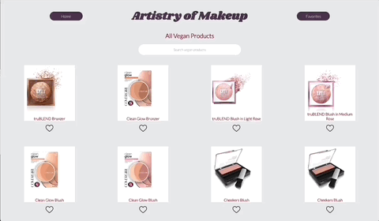
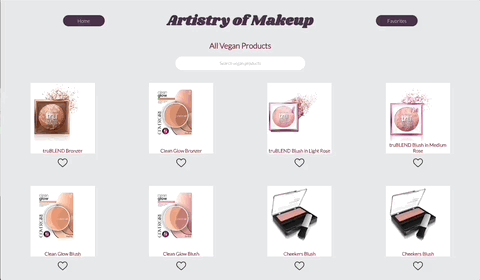

# Artistry of Makeup

## Deployed Link
[Link](https://artistry-of-makeup.herokuapp.com/)

## Overview
Artistry of Makeup is a web application that allows a user to browse through vegan makeup products, favorite items, search through the items, and view additional details about a specific product. 

## Author
[Rachel Hill](https://github.com/rachellhill)

## Technologies Used
- React 
- Router 
- CSS
- HTML 
- Cypress 

## Set Up Instructions
1. Clone down this repository
2. `cd` into `artistry-of-makeup`
3. run `npm i`
4. run `npm start` to view the app in a browser
5. run `npm run cypress` to view testing 

## Features 
- A user is able to view all products on the landing page. 
- A user can favorite and unfavorite products. 
- A user can view their favorited products
- A user can search for products and see a live search occur 
- A user can click on a product to view its specific details

## Application in Action

## Future Additions 
- Simulate a buying experience where a user can purchase a product
- Login page where a user can see their account details and previous purchases

## Project Spec
Project spec can be found [here](https://frontend.turing.edu/projects/module-3/showcase.html). 

## Wireframe & Architecture
Wireframe can be found [here](https://excalidraw.com/). 
